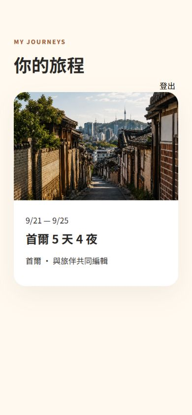
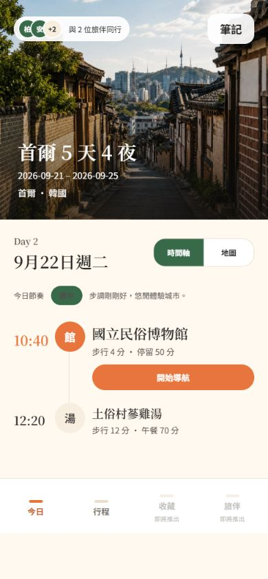
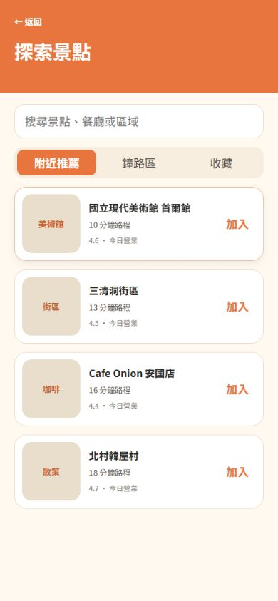
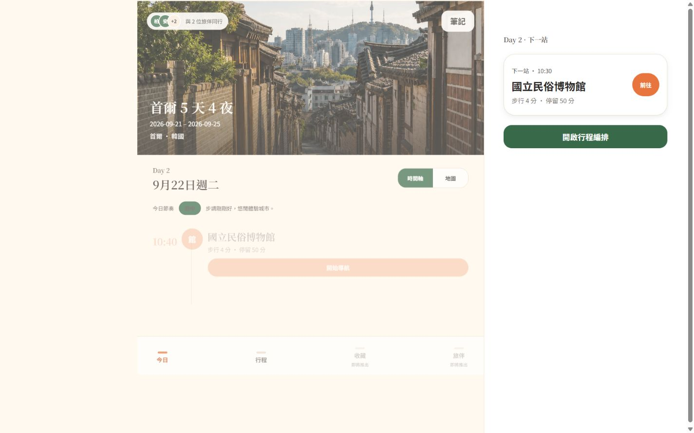

# 前端設計符合度稽核

時間戳：2026-08-27 11:14:10（Asia/Taipei，UTC+08:00）

## 結論

判定：**部分符合，核心 Happy Path 可操作，但尚未達到完整 Figma／交付內容一致。**

- 視覺語言符合：象牙白、柿橘、森林綠、繁體中文、Noto 系列字體與紙張式卡片層級一致。
- 核心流程符合：Demo 登入 → 旅程 → 今日行程 → 編排 → 探索 → 加入 → 衝突 → 回寫可完成。
- 資訊內容部分符合：主要標題、景點、日期、停留時間、固定行程與衝突文案存在。
- 功能完整度不符合：Figma 19 個畫面只實作其中一部分，探索篩選、加入設定、衝突詳情與多項產品功能仍缺少。
- 無障礙只能確認語意結構的部分優點，不能由截圖宣稱符合 WCAG 2.2 AA。

## 稽核範圍

- 前端：`http://localhost:5174/`
- 手機 viewport：390×844
- 桌面 viewport：1440×900
- 比對依據：`HANDOFF_FRONTEND.md`、`HANDOFF_FIGMA.md`、`FIGMA_PROGRESS.md` 與 Figma Core Screens。

## 流程步驟

### 1. 登入｜健康度：良好，但視覺未完全對齊

- 優點：Email label、輸入框、主要 CTA 與 Demo 入口清楚；手機畫面沒有溢位。
- 差異：Figma 登入畫面使用橘色品牌 Hero、Google 登入與 Magic Link 說明；前端採白色置中卡片與黑色 CTA。
- 判定：功能入口合理，但不是 Figma `50:44` 的忠實實作。

### 2. 旅程列表｜健康度：良好

- 優點：旅程卡片、日期、目的地與共同編輯資訊清楚，圖片使用正確品牌素材。
- 差異：此畫面未出現在目前 19 個 Figma Core Screens；需要補 Figma source-of-truth 或標註為前端新增必要頁。

### 3. 旅程總覽｜健康度：大致符合

- 優點：Hero、旅程日期、Day cards 與今日行程入口清楚；內容層級接近 Figma `28:6`。
- 風險：首屏只能看到部分 Day cards，底部內容需長距離捲動；沒有顯示 Figma 中的旅伴與預算摘要。

### 4. 今日行程｜健康度：高度符合

- 優點：Hero、旅伴、筆記、日期、步調、淡色時間軸、景點列、導航 CTA 與固定底部導覽均接近 Figma `28:3`。
- 差異：底部導覽仍以短線和文字代替正式 icon；收藏與旅伴停用，和完整產品需求不符。
- 可見風險：部分次要文字對比偏淡，需用對比工具實測。

### 5. 行程編排｜健康度：可用，但內容不足

- 優點：返回、日期 tabs、固定錨點與尋找景點 CTA 清楚；固定項目正確禁用拖曳。
- 差異：預設進入 Day 1，只有一個固定航班；Figma `61:44` 示範的 Day 2 多筆行程、暫存區與拖曳密度未呈現。
- 風險：上／下控制只顯示淡色單字，辨識度與觸控提示不足。

### 6. 附近／熱門景點｜健康度：部分符合

- 優點：搜尋、推薦 tabs、景點卡片與加入操作清楚。
- 缺少：目前位置列、熱門模式、分類 chips、距離／評分／營業中／停留時間篩選、地圖／列表切換。
- 差異：Figma 的獨立搜尋篩選畫面 `61:46` 被合併進探索頁，內容仍不完整。

### 7. 加入行程設定｜健康度：部分符合

- 優點：日期、時間、停留時間、備註與確認 CTA 可操作。
- 缺少：交通時間／Naver 摘要、固定時間 toggle、暫存選項與更完整的建議資訊。
- 一致性問題：時間欄顯示「下午 02:15」，CTA 顯示「14:15」，同頁時間格式不一致。

### 8. 衝突處理｜健康度：部分符合

- 優點：衝突原因、radio 選擇與主要確認 CTA 清楚；表單具原生語意。
- 缺少：受影響時間軸、自動重新安排選項，以及 Figma 中每個解法的建議／安全／智慧標籤。
- 文案較 Figma 精簡，使用者較難理解修改會影響哪些後續行程。

### 9. 成功回寫｜健康度：良好

- 優點：`role=status` 成功訊息清楚，新景點確實出現在行程中。
- 缺少：Undo toast、儲存中、失敗、重試與離線 pending 狀態。

### 10. 桌面響應式｜健康度：需修正

- 優點：採 main＋aside 雙欄，右側下一站面板提供桌面額外價值。
- 問題：主內容下半部呈現過度淡化，文字與 CTA 幾乎不可讀；底部手機導覽仍佔據桌面主欄。
- 問題：左側主欄與右側面板之間比例失衡，大量空白使內容密度不足。

## 最高優先修正

1. 修正桌面版主內容淡化／低對比問題，並重新定義桌面導航。
2. 補齊探索頁的位置、熱門、分類、篩選及地圖／列表功能。
3. 補回加入行程的交通資訊、固定時間與暫存選項。
4. 衝突頁加入受影響時間軸與「自動重新安排」方案。
5. 統一 12／24 小時制，避免欄位和 CTA 顯示不同格式。
6. 以正式 icon 取代底部導覽短線與文字替代物。
7. 補 loading、empty、error、offline、read-only、permission denied、Undo 狀態。

## 無障礙觀察

- 已確認的優點：主要頁面具有 heading、button、link、navigation、tablist、radio、status 等語意。
- 可見風險：桌面版低對比、部分淡灰次要文字、只用色彩表達選中狀態，以及拖曳控制的可理解性。
- 尚未驗證：鍵盤完整路徑、focus-visible、螢幕閱讀器輸出、色彩對比數值、200% zoom、reduced motion 與自動化 axe 測試。

## 最終判定

目前前端可作為 **MVP vertical slice 示範**，但不能視為「Figma 內容已完整落地」。今日行程符合度最高；旅程總覽與規劃流程大致正確；探索、加入設定、衝突處理及桌面響應式仍需要一輪 P0 修正。
